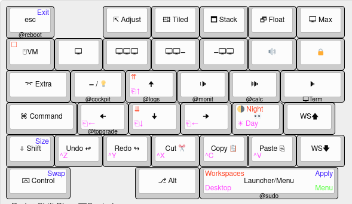

# About this project
PopOS use many keyboard shortcuts specially in tilling mode. This project takes a cheap keyboard and makes a specialized keyboard for Pop OS. 

It's a work in progress. The sky is the limit.

## The Layout

## The Keyboard

## Installation
* First study and then run the install.sh script
* Reboot
* Add your layouts in ~/.config/macro_keyboard/layouts
* Enable systemd user units for each keyboard

## Systemd cheatsheet
The systemd unit is templated on layout. So you can run many instances without mesing each other (hopefully)

* `systemctl --user list-units -all --no-pager "macro_keyboard*"`
* `systemctl --user enable --now macro_keyboard@layout`
* `systemctl --user start macro_keyboard@popos`
* `systemctl --user stop macro_keyboard@popos`

THE SOFTWARE IS PROVIDED "AS IS", WITHOUT WARRANTY OF ANY KIND,
EXPRESS OR IMPLIED, INCLUDING BUT NOT LIMITED TO THE WARRANTIES OF
MERCHANTABILITY, FITNESS FOR A PARTICULAR PURPOSE AND NONINFRINGEMENT.
IN NO EVENT SHALL THE AUTHORS BE LIABLE FOR ANY CLAIM, DAMAGES OR
OTHER LIABILITY, WHETHER IN AN ACTION OF CONTRACT, TORT OR OTHERWISE,
ARISING FROM, OUT OF OR IN CONNECTION WITH THE SOFTWARE OR THE USE OR
OTHER DEALINGS IN THE SOFTWARE.