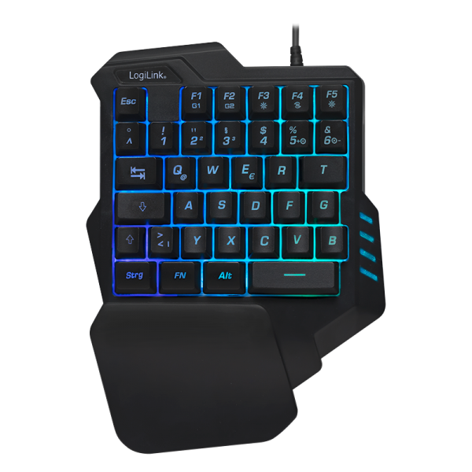

# About this project
PopOS use many keyboard shortcuts specially in tilling mode. This project takes a cheap keyboard and makes a specialized keyboard for Pop OS. 

It's a work in progress. The sky is the limit.

## The Layout

## The Keyboard

## Installation
* First study and then run the install scripts in tools direcory
* Reboot
* Add your layouts in ~/.config/macro_keyboard/layouts
* Enable systemd user units for each keyboard

## Systemd cheatsheet
The systemd unit is templated on layout. So you can run many instances without mesing each other (hopefully)

* `systemctl --user list-units -all --no-pager "macro_keyboard*"`
* `systemctl --user enable --now macro_keyboard@layout`
* `systemctl --user start macro_keyboard@popos`
* `systemctl --user stop macro_keyboard@popos`